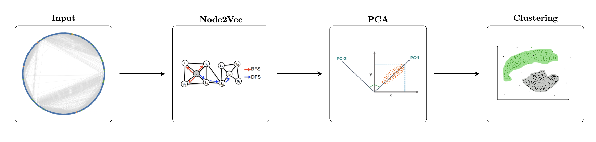
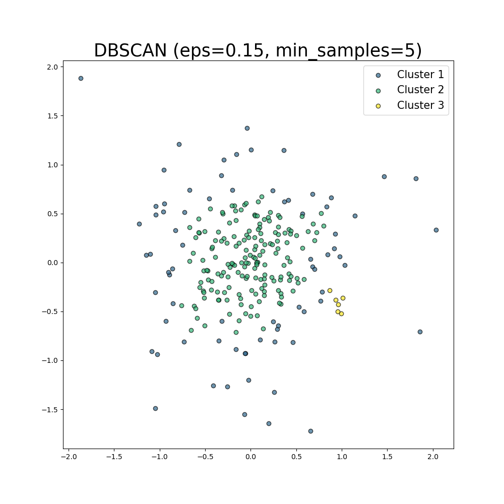

<h1 style="text-align: center;">
  <strong> Characterizing Extrachromosomal DNA Regions with Graph Neural Networks </strong>
</h1>

 

## **Background and Research Goals**
Explain...

## **Data**
### **HI-C Matrices**
Explain...
### **RNA-seq Reads**
Explain...
## **Interaction Graphs**
Display graphs here...

## **Methods**
### **Clustering**
We develop a pipeline as above to cluster our data. We take our ecDNA interaction graph, as defined above; apply node2vec on it, giving us 16-dimensional vectors for each node; append the read counts and gene counts to the embeddings; reduce the data to 2 dimensions using PCA; and lastly cluster the data using DB-SCAN. We then repeat the process on the HSR graph. DB-SCAN allows us to find an unspecified number of clusters because we did not have a pre-specified amount of classes that we were looking for.

 Figure 1: Clustering Pipeline 

### **Classification**

GraphSAGE [1] is useful for our classification problem due to differences in genomic interaction and genetic expression between HSR and ecDNA. In terms of genomic interaction, ecDNA has a circular structure [2], whereas HSR does not, allowing regions within ecDNA to uniquely interact. In terms of genetic expression, ecDNA is more expressive than HSR. Its existence off of the chromosome amplifies the genes it contains. Genomic interaction is represented by the edges in our graph, and expression is captured in the graph through the RNA-seq read count feature of the node vector. Notable differences in interactions and expression, captured by the structure and node features of the graph, naturally lead to the use of GraphSAGE for the classification task.

We trained GraphSAGE on a graph containing both the ecDNA and HSR portions, with each being a disjoint subgraph of a larger graph. Our model followed an encoder decoder paradigm. The encoder consisted of two GraphSAGE layers that generated 16-dimensional embeddings for each node. The decoder consisted of two linear fully connected layers with ReLU activation, reducing the dimensionality to a 2 dimensional output layer. Softmax was applied to the output layer for classification, and Cross Entropy loss was used to evaluate predictions and train the model.  

 Figure 2: Classification Pipeline 

## **Results**
### **Clustering Results**
These are the results of PCA and subsequent clustering for ecDNA (left) and HSR (right).

    
    

 Figure 3: ecDNA (left) and HSR (right) PCA clusters 

 

We visualized these clusters by overlaying their locations on top of the heatmap of the corresponding HI-C matrix. We also attached a gene track under each of the plots to visualize which genes were present within our loci range. It allows us to compare whether clusters match up with the presence of genes.

    
    

 Figure 4: ecDNA (left) and HSR (right) HI-C heatmap with clusters and gene track 

 

After computing these clusters, we checked if these clusters created significant differences in terms of multiple graph properties. Specifically, we applied a Mann-Whitney U-Test on all pairs clusters for each property that we were interested in. The following heatmap shows the p-values for each U-Test that we conducted. We defined significance at p < 0.05.

    

 Figure 5: ecDNA U-Test P-Values 

    

 Figure 6: HSR U-Test P-Values 

 

### **Classification Results**
We trained our GraphSAGE classification model on the combined graph G, obtaining the results in the table below. We split the graph into train, validation, and test sets using masks with a split of 70%/15%/15%. The test metrics in the table display the results of predictions on both the validation and test sets. Early stopping was implemented to capture the best performing model during training.

    

        <table>
            <thead>
                <tr>
                    <th>Metric</th>
                    <th>Train</th>
                    <th>Test</th>
                </tr>
            </thead>
            <tbody>
                <tr>
                    <td>Accuracy</td>
                    <td>0.92308</td>
                    <td><b>0.81333</b></td>
                </tr>
                <tr>
                    <td>Precision</td>
                    <td>0.92327</td>
                    <td>0.82799</td>
                </tr>
                <tr>
                    <td>Recall</td>
                    <td>0.92294</td>
                    <td><b>0.82719</b></td>
                </tr>
                <tr>
                    <td>F1 Score</td>
                    <td>0.92304</td>
                    <td>0.82744</td>
                </tr>
            </tbody>
        </table>
    

    

        
    

## **Discussion**
### **Clustering**
We defined three different types of clusters given our results - the sparse outliers, the dense core, and the more tightly clustered regions. We examined the nature of these three and came away with three conclusions:

1. Differences in ecDNA and HSR clusters suggest distinct sets of similarly behaving genes specific to each structure. We hypothesize that these differences in clusters from ecDNA and HSRs could come from their different 3d structures. Specifically, it tells us that in ecDNA, certain genomic regions are being brought together in new spatial neighborhoods, likely exposing different genes to regulatory elements like enhancers or promoters. Conversely, in HSRs, different clusters suggest a different structural pattern, which may be causing the regulation of an alternate set of genes
   
2. Less populous clusters within ecDNA reveal structurally related genes. The plot below shows how regions in the same cluster that correspond to genes are related in 3D space. For example, we can see two regions from Cluster 5 that correspond to genes NIPSNAP2 (blue) and ZNF713 (lime). Now from the figure on the right, we can see that these genes lie along a loop in 3d space. This gives us evidence toward the fact these genes may share regulatory elements like promoters or enhancers and be co-regulated/co-expressed in ecDNA.

    
    

 Figure 7: &nbsp;<strong>Left</strong>: ecDNA Structure with Clusters 4 and 5 highlighted &nbsp;<strong>Right</strong>: Same as &nbsp;<strong>Left</strong>&nbsp; but specific genes highlighted 

   
3. Graphically, the two most populous clusters in ecDNA and HSR behave significantly differently. At the 5% significance level, the only two clusters that were significant in all of the graph properties we looked at were Cluster 1 (outliers) and Cluster 2 (dense core). These two clusters behave distrinctly when it comes to HI-C interactions and gene/read counts.

### **Classification**
Of the four metrics we used to evaluate GraphSAGE, accuracy and recall are the most critical for our problem. Recall is particularly important for our task due to the cancerous properties of ecDNA. Recall weights false negatives, which for our problem, means predicting HSR (a benign region) when the region is ecDNA (a cancerous region). Failing to diagnose a patient with cancer is far more harmful than diagnosing a non-cancer patient with cancer, the false positive case. Fortunately, our GraphSAGE is generating balanced predictions, as seen in the confusion matrix.

GraphSAGE performed well on both the train and test sets, but there is a notable discrepancy of about 0.1 in each metric between the two sets. This is likely due to the small size of our dataset. However, strong performance on the train set is a positive indicator that GraphSAGE was able to find patterns in the graph structure and node features differentiating ecDNA and HSR. Obtaining more cell samples on the GBM39 cell line can boost the robustness of our graph learning model. To further extend research on the classification task, GNNExplainer [4] can be attached to the GraphSAGE model to learn key predictive regions of the graph. These subgraphs can be matched to their 3D location, which could uncover key differences in structure between ecDNA and HSR. 

## References
[1] **Hamilton, William L., Rex Ying, and Jure Leskovec.** 2018. “Inductive Representation Learning on Large Graphs.” [Link](https://arxiv.org/abs/1706.02216)

[2] **Prechelt, Lutz.** 2002. “Early stopping-but when?” In Neural Networks: Tricks of the trade. Springer: 55–69 [Link](https://link.springer.com/chapter/10.1007/3-540-49430-8_3)

[3] **Wu, Sihan, Kristen M Turner, Nam Nguyen, Ramya Raviram, Marcella Erb, Jennifer Santini, Jens Luebeck, Utkrisht Rajkumar, Yarui Diao, Bin Li et al.** 2019. “Circular ecDNA promotes accessible chromatin and high oncogene expression.” Nature 575 (7784): 699–703 [Link](https://www.nature.com/articles/s41586-019-1763-5)

[4] **Ying, Rex, Dylan Bourgeois, Jiaxuan You, Marinka Zitnik, and Jure Leskovec.** 2019. “GNNExplainer: Generating Explanations for Graph Neural Networks.” [Link](https://arxiv.org/abs/1903.03894)

